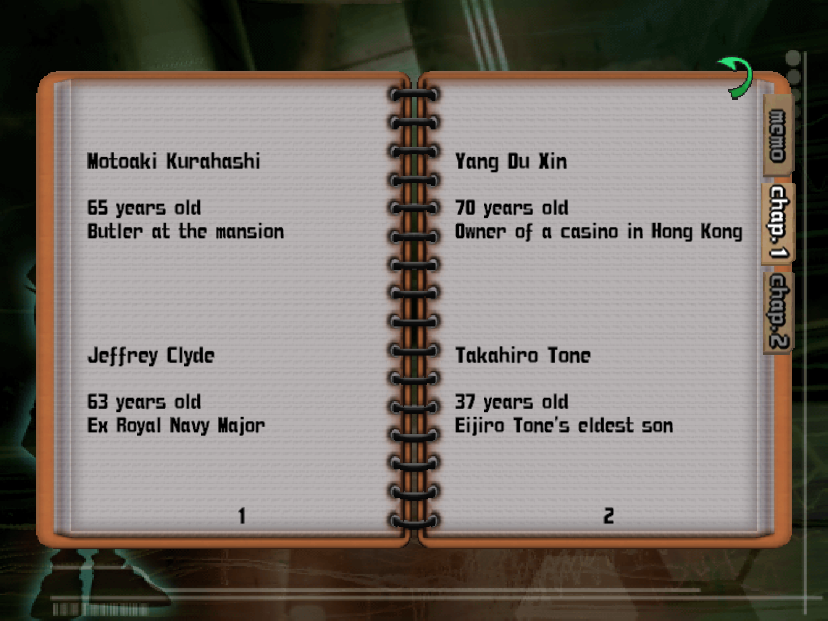

[](https://github.com/conan-patches/ps2)

<p align="center">
  ⭐ Star us on GitHub — it spreads Conan love!
</p>

<p align="center">
  <i align="center">Patches for the Detective Conan PlayStation 2 game released in 2004.</i>
</p>

<p align="center">
    Original name of the game : <i>名探偵コナン 大英帝国の遺産</i> (<i>Meitantei Konan: Daieiteikoku no Isan</i>)
</p>

## 📰 News

- 2024-11-17 English translation patch released 🚀 for the 20th anniversary of the game release 🎂!

## 📋 Available patches

- [English Translation](#-english-translation) Patch to translate 100% of the game to English
- More languages to come, come back later for more!

## 💬 English translation

100% English fan translation patch available, including video subtitles, menu, dialogues, credits.

<p align="center">
    
    
    
</p>

The patched game works on the *PCSX2* emulator and real *PS2* hardware.

## 💾 Downloads and checksums


| File (sha1sum)                                                                   | Size    | Download                                                            |
|----------------------------------------------------------------------------------|---------|---------------------------------------------------------------------|
| Original ISO<br/>0b083120da3565d649f3e27c328f89c33a9c05c1                        | 3.17 GB | Dump your own disc!<br/>Either original or Bandai the Best Edition. |
| CONAN_PS2_PATCH_ENGLISH_1.0.0-1.zip<br/>cb6beb24bd8e4875313826c4e9d9ad9862051c1f | 667 MB  | [💾 See releases](https://github.com/conan-patches/ps2/releases)    |
| CONAN_PS2_ENGLISH_PATCHED_1.0.0.iso<br/>f0d5f07f74d2357c3da174fa5d43c671489b269f | 2.21 GB | Generate this file using our patcher.                               |

The patchers work on Windows and Linux.

### How to use the patchers easily

Drag and drop the original ISO file onto the `WINDOWS_DROP_CONAN_PS2_ISO_HERE.bat` file if you are using Windows.

https://github.com/user-attachments/assets/25a0cf95-2634-42ac-a2b4-cea14cf0351f

Drag and drop the original ISO file onto the `LINUX_DROP_CONAN_PS2_ISO_HERE.sh` file if you are using Linux. Note: The file must be executable and your environnment must be allowing drag and drop a file onto a `.sh` script.

### How to use the patchers manually (using command line)

```bash
# In Windows CMD
.\WINDOWS_DROP_CONAN_PS2_ISO_HERE.bat original_conan_ps2.iso

# In a Linux shell
bash LINUX_DROP_CONAN_PS2_ISO_HERE.sh original_conan_ps2.iso
```

## 🏆 Credits

These patches are provided thanks to the work of these awesome people and contributors over the years:

|                     | Credits                             |
|---------------------|-------------------------------------|
| English translation | Bingokemski, Daszto Lio, SONICMAN69 |
| Programmers         | kerneloops, anonymous               |
| Graphics            | Epix, Illyridian, anonymous         |
| Extra graphics      | eva, Nasu, Satonaru, Terwilf        |

